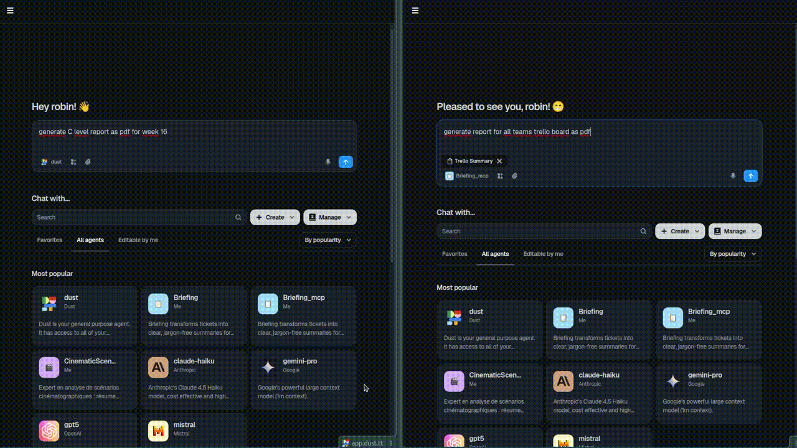

# dust-assignement : Trello to Dust synchronization for agent use case


Allow using Dust agent on trello board data:



## Choosing an integration approach

Two architectures are available to connect Trello and Dust. Pick the one that fits your use case:

| | **Sync script** (push) | **MCP server** (pull) |
|---|---|---|
| **How it works** | Runs on a schedule; pushes Trello board snapshots into Dust data sources as documents | Dust agent calls the MCP server at query time; the server fetches live data from Trello |
| **Data flow direction** | Push — your infra → Dust | Pull — Dust agent → your MCP server → Trello |
| **Trello credentials exposure** | Stay entirely on your infra; never sent to Dust | Sent by the Dust agent as HTTP headers on every request |
| **Data freshness** | Depends on sync frequency (hourly, daily, weekly…) | Always real-time — data is fetched at the moment the agent asks |
| **Token consumption** | Low — Dust indexes documents and retrieves only relevant chunks via RAG | Higher — full board data is injected into the agent's context window |
| **Persistent document / audit trail** | Yes — each sync upserts a versioned document in Dust; past snapshots can be queried later | No — data is ephemeral, lives only in the current context window |
| **Agent run decoupled from Trello availability** | Yes — agent queries Dust even if Trello is down or slow | No — a Trello outage or rate-limit failure blocks the agent |
| **Scales to large boards** | Well — chunking and embedding happen offline, before the agent runs | Less well — entire board content must fit in the context window |
| **Operational cost** | A cron job or scheduled Docker container | An always-on HTTP server (e.g. Fly.io) |
| **Best for** | Weekly reports, historical trend analysis, background knowledge bases, offline RAG | Real-time board inspection, taking actions on cards, ad-hoc queries where staleness is unacceptable |


---

### Deploying Script solution

The sync script is a one-shot Docker container — run it on a schedule (cron, CI, or any scheduler).

**1. Build the image**

```bash
make build-script
```

**2. Run locally**

```bash
docker run --env-file .env synchronize-trello-to-dust:latest \
  <space_id> <ds_id> 'Board One' 'Board Two'
```

**3. Publish to Docker Hub and run from anywhere**

```bash
export DOCKER_USER=yourdockerhubusername
make push-script                   # tag: latest
make push-script IMAGE_TAG=1.0.0   # custom tag

docker run --env-file .env \
  yourdockerhubusername/synchronize-trello-to-dust:latest \
  <space_id> <ds_id> 'Board One' 'Board Two'
```

Required env vars:

| Variable | Description |
|---|---|
| `TRELLO_API_KEY` | Trello API key |
| `TRELLO_API_SECRET` | Trello API secret |
| `TRELLO_TOKEN` | Trello OAuth token |
| `DUST_API_KEY` | Dust API key |
| `DUST_WORKSPACE_ID` | Dust workspace ID |

**4. Schedule it (example: system cron)**

```cron
0 * * * *  docker run --env-file /path/to/.env \
  yourdockerhubusername/synchronize-trello-to-dust:latest \
  sPxyz dsAbc 'Engineering Backlog'
```


### Deploying MCP solution

The MCP server is a long-running HTTP server. The recommended host is [Fly.io](https://fly.io) — a `fly.toml` is already included.

**1. Build the image**

```bash
make build-mcp
```

**2. Run locally**

```bash
docker run -p 8080:8080 \
  -e MCP_AUTH_TOKEN=your-secret-token \
  dust-sync-mcp:latest
```

The server listens on `http://localhost:8080`. Trello credentials are passed per-request via HTTP headers (see table below).

**3. Deploy to Fly.io**

```bash
# Install the Fly CLI if needed: https://fly.io/docs/hands-on/install-flyctl/
fly auth login

# First deploy — creates the app defined in fly.toml (app = 'dust-assignement', region = cdg)
fly launch --no-deploy

# Set the auth token secret
fly secrets set MCP_AUTH_TOKEN=your-secret-token

# Deploy
fly deploy
```

Subsequent deployments:

```bash
fly deploy
```

Check status and logs:

```bash
fly status
fly logs
```

**4. Publish to Docker Hub (optional, for self-hosted)**

```bash
export DOCKER_USER=yourdockerhubusername
make push-mcp                   # tag: latest
make push-mcp IMAGE_TAG=1.0.0   # custom tag

docker run -p 8080:8080 \
  -e MCP_AUTH_TOKEN=your-secret-token \
  yourdockerhubusername/dust-sync-mcp:latest
```

**Per-request headers expected by the server:**

| Header | Description |
|---|---|
| `Authorization` | `Bearer <MCP_AUTH_TOKEN>` |
| `X-Trello-Api-Key` | Trello API key |
| `X-Trello-Api-Secret` | Trello API secret |
| `X-Trello-Token` | Trello OAuth token |


## Development

**Install dependencies**

```bash
make install        # creates .venv and installs requirements.txt
source .venv/bin/activate
```

**Run tests**

```bash
make test
```

Tests use in-memory fakes for both Trello and Dust — no real credentials needed.

**Project layout**

```
src/
├── project_management/   # Trello abstraction
│   ├── abstract.py       # ProjectManagementTool interface
│   ├── trello_client.py  # Trello API implementation
│   └── in_memory.py      # In-memory fake (used in tests)
├── data_sources/         # Dust abstraction
│   ├── abstract.py       # DataSourceTool interface
│   ├── dust_client.py    # Dust API implementation
│   └── in_memory.py      # In-memory fake (used in tests)
├── use_cases/
│   └── synchronize_trello_to_dust.py   # sync script entry point
└── mcp_servers/
    └── server.py         # MCP HTTP server entry point

test/
├── use_cases/            # sync script tests
└── mcp_servers/          # MCP server tests

build/
├── Dockerfile            # sync script image
└── Dockerfile.mcp        # MCP server image
```

The two implementations (`trello_client` / `dust_client`) depend only on their abstract interfaces, so they can be swapped or faked independently in tests.